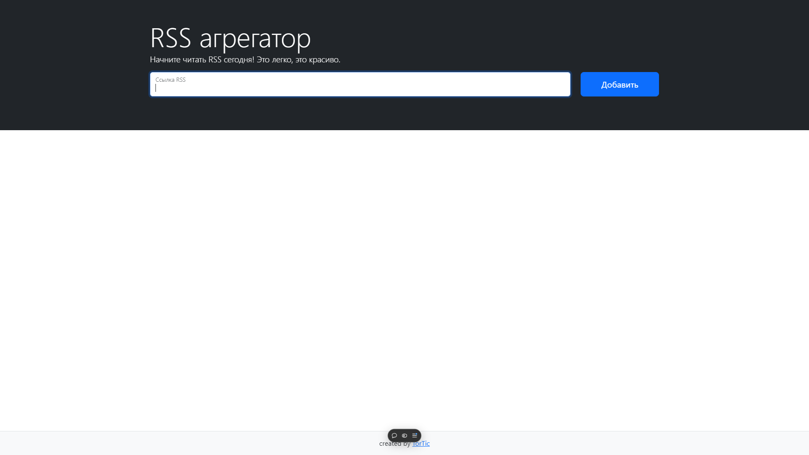

### Hexlet tests and linter status:

[](https://github.com/TorTicc/frontend-project-11/actions)
[](https://codeclimate.com/github/TorTicc/frontend-project-11/maintainability)

## Rss Reader
Сервис, предназначенный для описания лент новостей, анонсов статей и других материалов. С помощью него удобно читать разнообразные источники, например, блоги, ленты новостей, анонсы статей и др. Он позволяет добавлять неограниченное количество RSS-лент, сам их обновляет и добавляет новые записи в общий поток.

## Demo version
https://frontend-project-11-9y8r.vercel.app/?url=cdxcdx

## Installation
1. Clone the repository
```
git clone git@github.com:TorTicc/frontend-project-11.git
cd frontend-project-11
code .
```
2. Installing dependencies
```
make install
```
3. Starting a local server
```
make develop
```
4. Enjoy my creation
```
Thanks for watching =)
```

